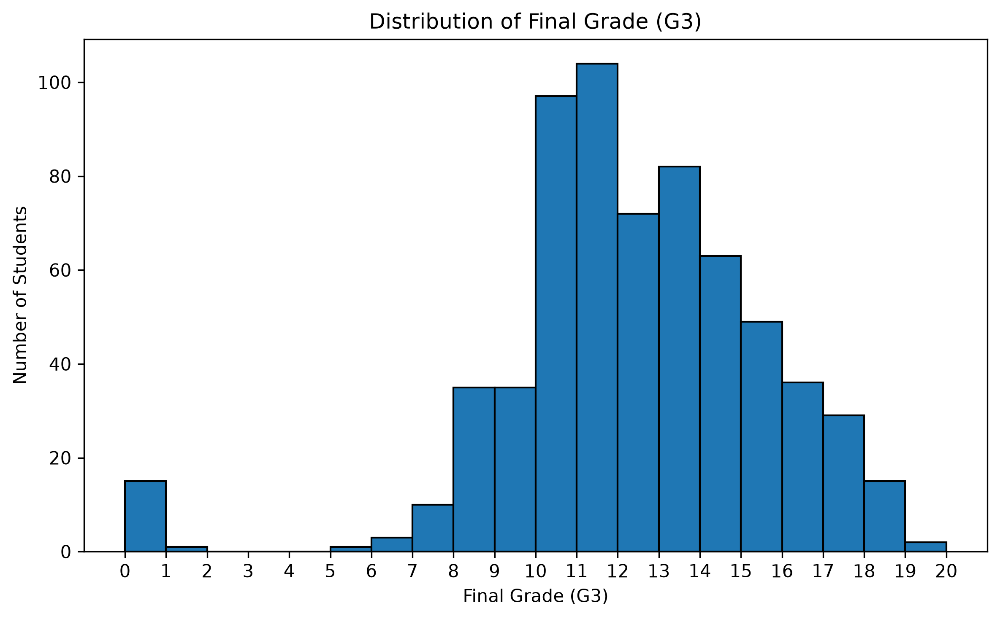
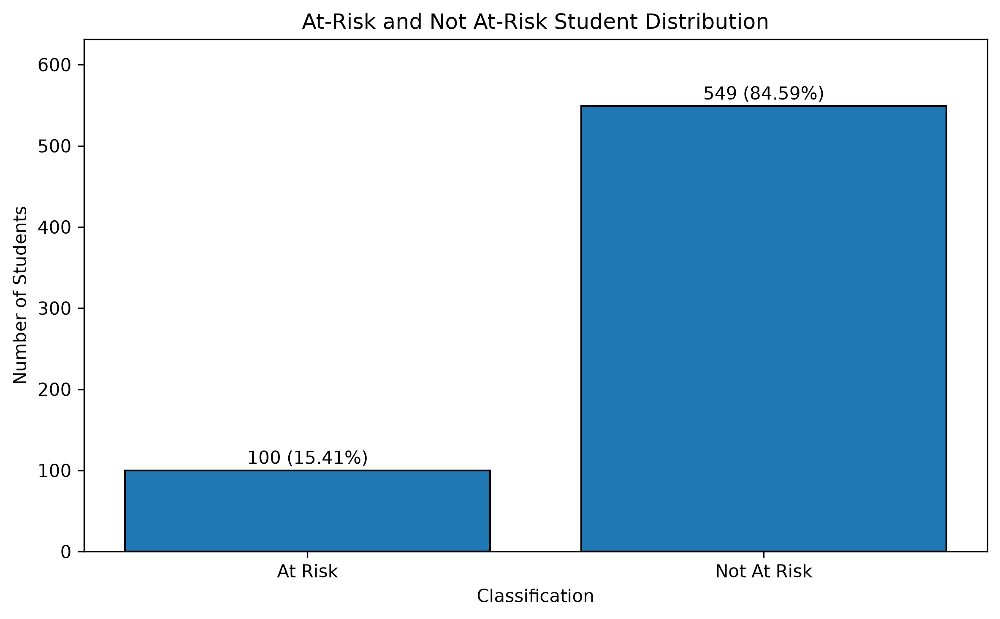
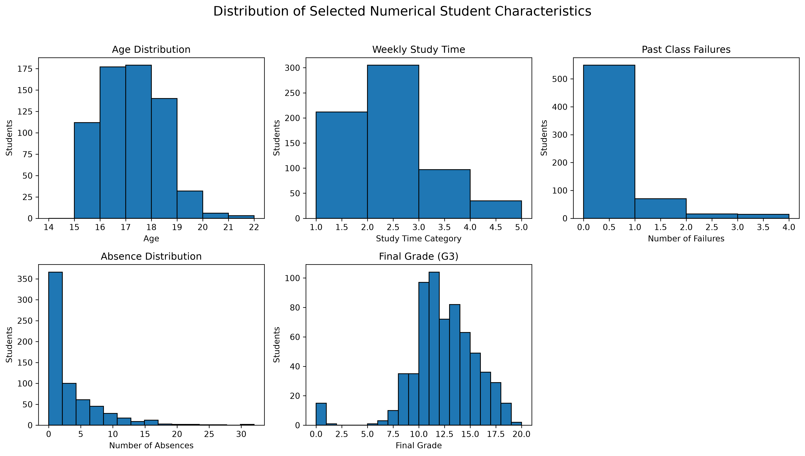
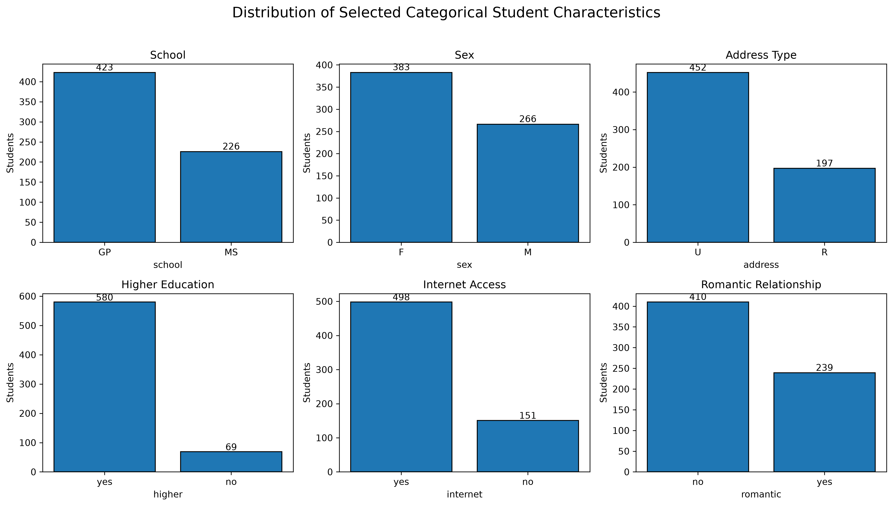
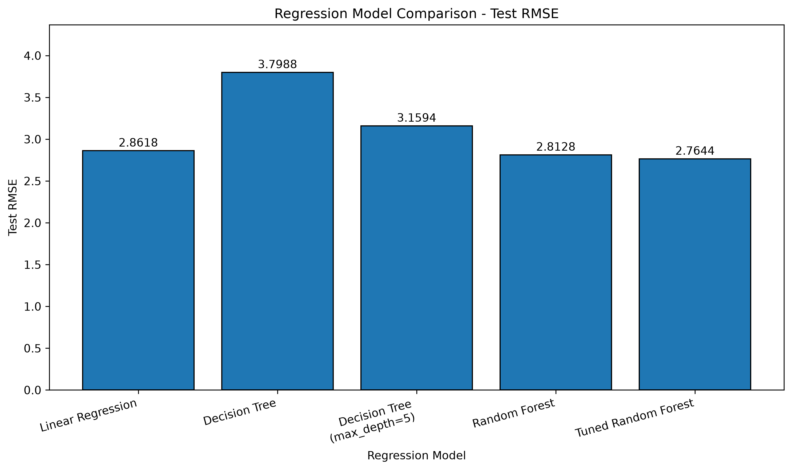
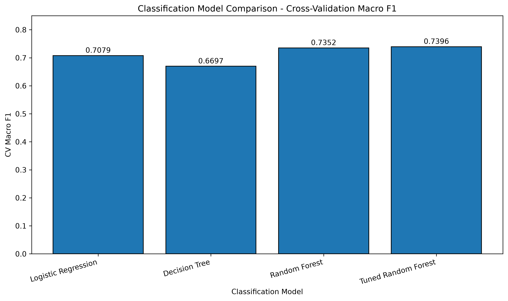
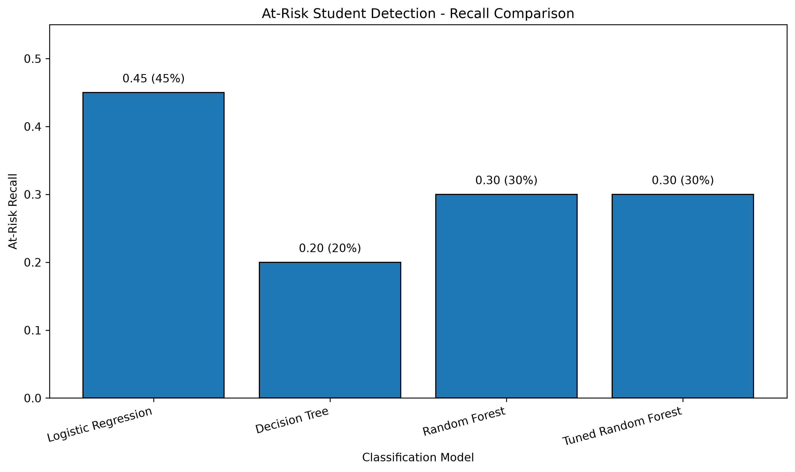
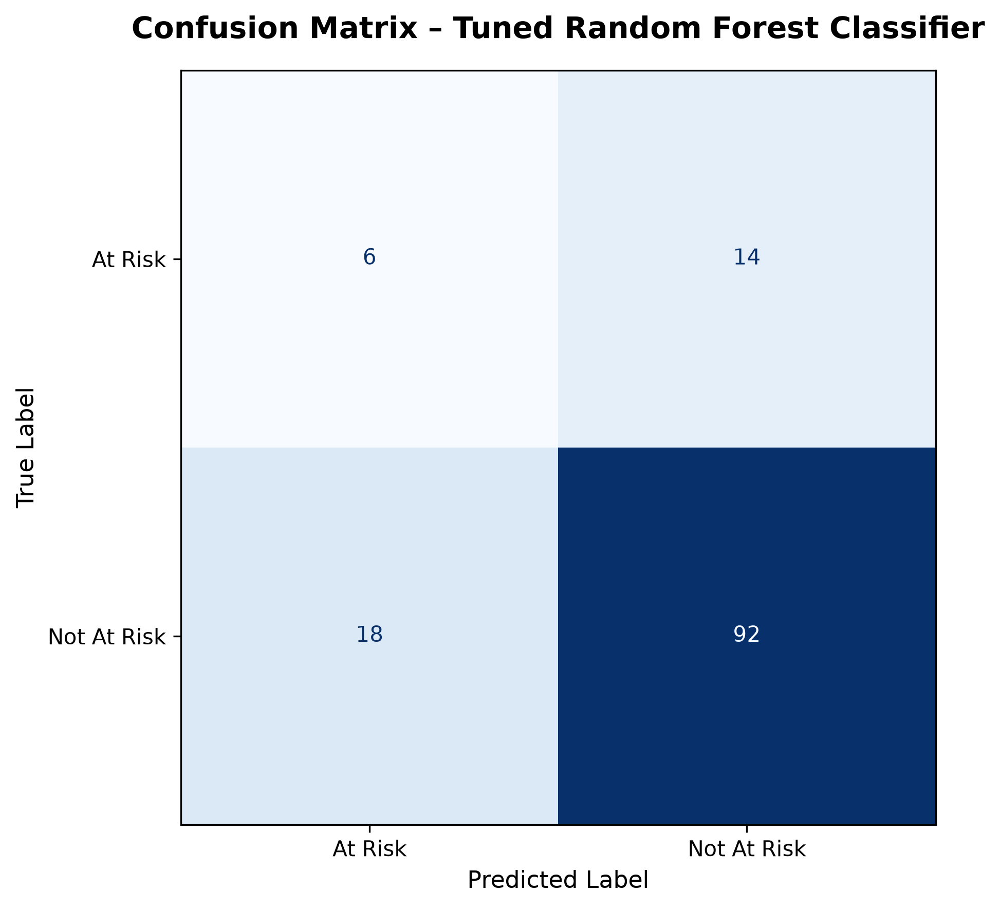
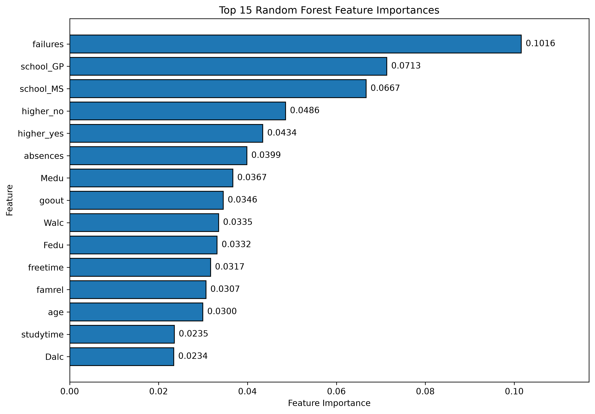

# Early Prediction of Student Academic Performance Using Machine Learning

## Abstract

This project investigates the application of machine learning techniques to predict student academic performance and identify students at risk of poor academic outcomes. Using the UCI Student Performance dataset containing 649 student records, models were developed to predict the final grade (G3) using demographic, social, family, behavioural, and school-related characteristics, without relying on previous academic grades (G1 and G2). The study investigated a regression task to predict the continuous final grade and a classification task to detect students at risk of scoring below a passing grade (G3 < 10). The Tuned Random Forest model was selected for regression, achieving a cross-validation RMSE of 2.6325 and a test R² of 0.2164. For classification, the Tuned Random Forest achieved an overall test accuracy of 75.38%. However, due to class imbalance, Logistic Regression proved more effective for the specific task of identifying at-risk students, achieving an At-Risk recall of 45% on the held-out test set compared to 30% for the Random Forest models. The results demonstrate that while early prediction of academic performance is challenging, machine learning can identify useful patterns to support potential early educational interventions.

## 1. Introduction

### 1.1 Background

Educational institutions collect large amounts of data that can be analysed to understand and predict student academic performance. The use of Educational Data Mining (EDM) and machine learning allows educators to explore complex relationships between various student characteristics. Predictive models can help identify patterns associated with academic success or difficulty, allowing institutions to provide timely support.

### 1.2 Problem Statement

Identifying students who require additional academic support is a challenge for educational institutions. Traditional analysis methods often struggle to capture the complex relationships between a student's demographic, behavioural, social, family, and school-related characteristics. Therefore, this study investigates whether machine learning models can identify these patterns and provide early predictions to support potential academic interventions.

### 1.3 Research Aim

The main aim of this project is to investigate whether machine learning can be used to predict student final academic performance and identify students who may be at risk of poor academic outcomes.

### 1.4 Research Objectives

1. Acquire and understand the UCI Student Performance dataset.
2. Explore demographic, academic, social, family, behavioural, and lifestyle characteristics.
3. Prepare the dataset for machine learning using appropriate preprocessing techniques.
4. Develop regression models to predict the final grade (G3).
5. Develop classification models to identify at-risk students.
6. Compare candidate machine learning algorithms using appropriate evaluation metrics.
7. Apply hyperparameter tuning to selected models.
8. Evaluate final models using cross-validation and held-out test data.
9. Identify important features associated with model predictions.
10. Discuss the limitations and practical implications of the results.

### 1.5 Research Questions

*   **Primary Research Question:** Can machine learning models predict students' final academic performance using demographic, family, social, behavioural, and school-related characteristics?
*   **Secondary Research Question:** Can machine learning models identify students who may be at risk of poor final academic performance?
*   **Additional Question:** Which student characteristics contribute most strongly to the classification model's predictions?

### 1.6 Scope of the Study

The scope of this project is limited to the UCI Student Performance dataset. A critical aspect of the study is the exclusion of the previous academic period grades (G1 and G2) from the primary predictive experiments. This ensures the models simulate an early-prediction scenario, relying purely on background, behavioural, and contextual factors rather than established academic history.

### 1.7 Significance of the Study

The ability to predict academic performance early can provide valuable insights for educators. By identifying at-risk students before final grades are determined, interventions can be targeted towards individuals who may need additional support, potentially improving overall educational outcomes.

## 2. Literature Review

### 2.1 Educational Data Mining

Educational Data Mining (EDM) provides methods for extracting useful information from educational datasets. Student performance prediction is an important EDM task because predictive models can potentially help educators identify patterns associated with academic success or difficulty. Zhang et al. [6] describe student performance prediction as an important application of EDM, noting the process involves data collection, problem formulation, modelling, prediction, and practical application.

### 2.2 Student Performance Prediction

Cortez and Silva [1] introduced the Student Performance dataset, which contains information about student demographics, family background, school characteristics, social relationships, study behaviour, and lifestyle. They investigated student achievement prediction using the final grade (G3) and considered previous-period grades G1 and G2. Predicting the final grade without G1 and G2 is a more difficult problem but is considered more useful for an early-prediction scenario [1].

### 2.3 Factors Associated with Academic Performance

Student performance is associated with a wide range of factors. Saa, Al-Emran and Shaalan [3] reviewed predictive research and identified several broad groups of predictive factors, including e-learning activity, demographic characteristics, and social information. Student background, behavioural characteristics, and educational factors provide useful information for predictive modelling, supporting the use of the 30 non-academic predictors in the present study.

### 2.4 Regression-Based Student Performance Prediction

Regression methods are appropriate when the target is a continuous outcome. Shahiri and Husain [2] reviewed machine learning techniques for student performance prediction, demonstrating the broad use of predictive modelling approaches. Al-Shabandar et al. [5] also examined predictive approaches for learning-outcome prediction.

### 2.5 Classification and At-Risk Student Identification

Classification can identify students who may be at risk of poor academic performance. Alyahyan and Düştegör [4] highlighted the potential use of predictive systems to identify at-risk students and emphasized the importance of methodological considerations. Ewais et al. [7] similarly examined machine-learning approaches for early identification of at-risk students. Because at-risk students often represent a minority class, accuracy alone is insufficient for evaluating these models.

### 2.6 Machine Learning Model Evaluation

Reliable evaluation is essential in EDM to ensure generalization to unseen students. Cross-validation, independent test sets, and multiple evaluation metrics are recommended rather than relying on a single measure [4], [5].

### 2.7 Research Gap

While previous studies demonstrate that machine learning can predict performance, challenges remain. Models often rely on previous grades, which are unavailable for early intervention. Additionally, identifying at-risk students presents a class-imbalance challenge, where models may achieve high overall accuracy but fail to identify the minority at-risk group. Finally, predictions must be interpreted carefully as decision-support tools, not definitive judgements.

## 3. Methodology

### 3.1 Research Approach

This project uses a supervised machine learning approach to investigate student performance. Two prediction tasks are investigated: regression (predicting the continuous final grade G3) and classification (identifying at-risk students). The experiments are implemented using Python and scikit-learn.

### 3.2 Dataset

The project uses the UCI Student Performance dataset (320), containing 649 student records and 30 predictor variables describing demographic, family, school, social, behavioural, and lifestyle characteristics. The primary academic outcome is G3 (final grade). G1 and G2 are excluded from the primary experiments to simulate early prediction.

### 3.3 Data Collection

The dataset was obtained programmatically from the UCI Machine Learning Repository using the `ucimlrepo` Python package. Features and targets were stored separately.

### 3.4 Data Understanding

The data understanding process included inspecting dataset dimensions, data types, missing values, and examining the distribution of numerical and categorical variables, including the final grade and the classification target.

### 3.5 Data Preprocessing

Preprocessing involved separating predictors from target variables, encoding categorical features, and scaling numerical features using scikit-learn pipelines to prevent data leakage. No missing values required imputation.

The main preprocessing decisions are summarized below.

| Preprocessing Operation | Applied | Reason |
|---|---|---|
| Missing value handling | No imputation required | No missing values were found |
| Duplicate checking | Yes | Dataset quality was checked |
| Categorical encoding | Yes | Categorical variables must be converted to numerical representation |
| Numerical scaling | Yes | Numerical features were standardized |
| Feature selection | Yes | G1 and G2 were excluded from the primary early-prediction experiment |
| Binning | No | Binning was not required for the selected modelling methods |
| Dimensionality reduction | No | The resulting feature space was manageable |
| Sampling | No | The dataset size was manageable without sampling |
| Discretization | No | The continuous G3 target was required for the regression task |

### 3.6 Feature Engineering

The classification target was engineered from the final grade (G3):
*   At Risk: G3 < 10
*   Not At Risk: G3 >= 10

### 3.7 Regression Task

The regression task evaluated Linear Regression, Decision Tree Regression, and Random Forest Regression using cross-validation and a held-out test set. Primary metrics included Root Mean Squared Error (RMSE), Mean Absolute Error (MAE), and the R² score.

### 3.8 Classification Task

The classification task evaluated Logistic Regression, Decision Tree Classification, and Random Forest Classification. Due to class imbalance, evaluation metrics included Macro F1-score, At-Risk Recall, and Accuracy.

### 3.9 Model Training

Models were trained on the preprocessed training dataset, with random states set for reproducibility.

### 3.10 Cross-Validation

Cross-validation was used to obtain reliable estimates of model performance and compare candidate models during the selection process.

### 3.11 Hyperparameter Tuning

RandomizedSearchCV was used to optimize hyperparameters for the Random Forest models, exploring `n_estimators`, `max_depth`, `min_samples_split`, `min_samples_leaf`, and `max_features`.

### 3.12 Final Model Evaluation

The final evaluation consolidated regression and classification experiments, comparing cross-validation and test set performance, identifying feature importance, and distinguishing overall classification performance from specific At-Risk detection capabilities.

### 3.13 Ethical Considerations

Predictions about student academic performance should not be treated as definitive judgments. Machine learning predictions may contain errors and reflect training data patterns. An at-risk prediction should be interpreted as a potential indicator for further review and support rather than a final classification of a student's ability.

### 3.14 Project Limitations

Limitations include the small dataset size (649 records), difficulty in reliably identifying the minority at-risk class, the limited explanatory power of models when excluding previous grades, and the absence of potentially relevant external factors not collected in the dataset.

## 4. Results

### 4.1 Dataset Overview

The dataset contained 649 rows and 33 columns, including 30 predictor variables and the academic grade variables. There were no missing values or duplicate rows.

The final grade (G3) was used as the main outcome variable for the regression task. Figure 1 shows the distribution of final grades in the dataset.

**Figure 1. Distribution of final grade (G3) among the 649 students.**

The mean final grade was 11.91, with a median of 12. The observed grades ranged from 0 to 19.

For the classification task, students with G3 below 10 were classified as At Risk, while students with G3 equal to or above 10 were classified as Not At Risk. Figure 2 shows the resulting class distribution.

**Figure 2. Distribution of At-Risk and Not At-Risk students.**

There were 100 At-Risk students (15.41%) and 549 Not At-Risk students (84.59%). This shows that the classification task has a clear class imbalance, with the At-Risk group representing the minority class.

### 4.2 Data Exploration Results

Exploratory data analysis was performed to understand the main characteristics of the students before applying the machine learning models. Both numerical and categorical variables were examined.

Figure 3 shows the distribution of selected numerical variables, including age, weekly study time, past class failures, absences, and the final grade.

**Figure 3. Distribution of selected numerical student characteristics.**

The average age of the students was 16.74 years. The average study time category was 1.93, while the average number of previous class failures was 0.22. The mean number of absences was 3.66 and the mean final grade was 11.91.

The failure and absence variables are particularly relevant because they describe aspects of the student's previous academic and behavioural situation. However, these variables should not be interpreted as direct causes of final performance.

Figure 4 presents several categorical characteristics of the students.

**Figure 4. Distribution of selected categorical student characteristics.**

The dataset contained 423 students from GP school and 226 students from MS school. There were 383 female students and 266 male students. Most students lived in urban areas, with 452 students classified as urban and 197 as rural.

A large majority of students reported wanting to continue to higher education, with 580 students answering yes. Internet access was also available to 498 students, while 151 students reported no internet access. Regarding romantic relationships, 410 students reported no relationship and 239 reported having a relationship.

These distributions show that the dataset contains a mixture of demographic, educational, social, and behavioural characteristics that can be used as predictors.

### 4.3 Preprocessing Results

Numerical variables were successfully standardized. Categorical variables were one-hot encoded, expanding the feature space appropriately for machine learning algorithms without introducing data leakage.

### 4.4 Regression Results

The regression models were evaluated on their ability to predict the final grade (G3).

| Model | Test MAE | Test RMSE | Test R² | CV RMSE |
| :--- | :--- | :--- | :--- | :--- |
| Linear Regression | 2.1564 | 2.8618 | 0.1602 | 2.7897 |
| Decision Tree | 2.8615 | 3.7988 | -0.4798 | 3.7841 |
| Decision Tree (max_depth=5) | 2.3720 | 3.1594 | -0.0236 | 3.1983 |
| Random Forest | 2.0505 | 2.8128 | 0.1887 | 2.7238 |
| Tuned Random Forest | 2.0116 | 2.7644 | 0.2164 | 2.6325 |

Figure 5 compares the test RMSE of the five regression models. Lower RMSE indicates lower prediction error.

**Figure 5. Comparison of regression models using test RMSE.**

The Decision Tree produced the highest test RMSE of 3.7988, showing weaker prediction performance on the unseen test data. Linear Regression achieved a test RMSE of 2.8618. The initial Random Forest improved this result to 2.8128, while the Tuned Random Forest achieved the lowest test RMSE of 2.7644.

The Tuned Random Forest therefore provided the best regression performance among the evaluated models.

### 4.5 Classification Results

The classification models were evaluated on their ability to classify students as At Risk or Not At Risk.

| Model | CV Macro F1 | Test Accuracy | Test Macro F1 | Test At-Risk Recall | Test At-Risk F1 |
| :--- | :--- | :--- | :--- | :--- | :--- |
| Logistic Regression | 0.7079 | 65.38% | 0.5286 | 45.00% | 0.2857 |
| Decision Tree | 0.6697 | 70.77% | 0.4982 | 20.00% | 0.1739 |
| Random Forest (Initial) | 0.7352 | 76.15% | 0.5681 | 30.00% | 0.2791 |
| Tuned Random Forest | 0.7396 | 75.38% | 0.5623 | 30.00% | 0.2727 |

Figure 6 compares the classification models using cross-validation Macro F1-score.

**Figure 6. Classification model comparison using cross-validation Macro F1-score.**

The Tuned Random Forest achieved the highest cross-validation Macro F1-score of 0.7396, followed by the initial Random Forest with 0.7352. Logistic Regression achieved 0.7079, while the Decision Tree achieved the lowest value of 0.6697.

This indicates that the Tuned Random Forest provided the strongest overall classification performance during cross-validation.

The Initial Random Forest achieved a test accuracy of 76.15% and
demonstrated strong cross-validation performance. However, its
At-Risk recall was only 30%, showing that strong overall performance
did not translate into reliable identification of the minority
At-Risk class. The Tuned Random Forest achieved a test accuracy of
75.38%, a test Macro F1-score of 0.5623, and an At-Risk F1-score of
0.2727.

### 4.6 At-Risk Detection Results

At-Risk Recall measures the proportion of genuinely At-Risk students that are correctly identified by the classifier. A higher recall is desirable when the objective is to identify students who may require additional academic support.

Figure 7 compares the At-Risk recall achieved by the evaluated classification models on the held-out test set.

**Figure 7. Comparison of classification models using held-out At-Risk recall.**

The Logistic Regression model achieved the highest At-Risk recall at 45%, correctly identifying the largest proportion of students belonging to the minority At-Risk class. The Decision Tree achieved 20%, while both the Initial Random Forest and Tuned Random Forest achieved 30%.

Although the Random Forest models achieved higher overall test accuracy, their lower At-Risk recall demonstrates the effect of class imbalance. Therefore, Logistic Regression provides a useful alternative when the primary objective is identifying as many potentially At-Risk students as possible.

The confusion matrix for the Tuned Random Forest provides a more detailed view of its classification performance on the held-out test set.

**Figure 8. Confusion matrix of the Tuned Random Forest classifier on the held-out test set.**

The confusion matrix shows that 6 At-Risk students were correctly identified, while 14 At-Risk students were incorrectly classified as Not At Risk. For the Not At Risk class, 92 students were correctly classified and 18 were incorrectly classified as At Risk.

These results further demonstrate the difficulty of identifying the minority At-Risk class. Although the model correctly classified most Not At Risk students, a considerable number of At-Risk students were still missed. Therefore, the confusion matrix supports the earlier finding that overall classification performance and At-Risk detection performance are different objectives.

### 4.7 Hyperparameter Tuning Results

The selected classification hyperparameters for the Tuned Random Forest were: `n_estimators = 100`, `max_depth = 20`, `min_samples_split = 5`, `min_samples_leaf = 1`, and `max_features = log2`.
The selected regression hyperparameters were: `n_estimators = 300`, `max_depth = 10`, `min_samples_split = 2`, `min_samples_leaf = 4`, and `max_features = 0.5`.
Tuning slightly improved the cross-validation metrics but did not significantly improve the held-out test performance compared to the initial Random Forest.

### 4.8 Feature Importance

Feature importance analysis was performed using the Tuned Random Forest classifier. Figure 9 presents the top 15 transformed features according to their Random Forest feature importance values.

**Figure 9. Top 15 feature importance values from the Tuned Random Forest classifier.**

The most important feature was the number of previous class failures (`failures`), with an importance value of 0.1016. The school-related features `school_GP` and `school_MS` followed with importance values of 0.0713 and 0.0667 respectively.

Other relatively important features included the student's intention to pursue higher education (`higher_no` and `higher_yes`), number of absences (`absences`), mother's education (`Medu`), social activity (`goout`), weekend alcohol consumption (`Walc`), father's education (`Fedu`), free time (`freetime`), family relationship quality (`famrel`), age, study time, and daily alcohol consumption (`Dalc`).

The feature importance results indicate that previous class failures, school characteristics, educational aspirations, absences, and family or behavioural characteristics contributed strongly to the classification model's predictions. However, feature importance represents the contribution of variables to model predictions and should not be interpreted as proof of direct causal relationships.

### 4.9 Final Model Selection

*   **Regression:** Tuned Random Forest (Lowest CV RMSE: 2.6325)
*   **Overall Classification:** Tuned Random Forest (Highest CV Macro F1: 0.7396)
*   **At-Risk Detection:** Logistic Regression (Highest Test At-Risk Recall: 45%)

### 4.10 Overall Experimental Summary

| Task | Selected Model | Main Evaluation Metric | Result |
|---|---|---|---:|
| Regression | Tuned Random Forest | Test RMSE | 2.7644 |
| Regression | Tuned Random Forest | Test R² | 0.2164 |
| Classification | Tuned Random Forest | Test Accuracy | 75.38% |
| Classification | Tuned Random Forest | Test Macro F1 | 0.5623 |
| At-Risk Detection | Logistic Regression | At-Risk Recall | 45% |

The results show that the best overall model depends on the objective.
The Tuned Random Forest was selected for the regression task and
overall classification performance, while Logistic Regression was
more effective for the specific objective of detecting students in
the minority At-Risk class.

## 5. Discussion

### 5.1 Regression Findings

The regression models demonstrated modest predictive performance. The Tuned Random Forest achieved an R² of 0.2164, indicating that the model explains approximately 21.6% of the variance in final grades. While this represents a positive predictive signal, it also highlights the difficulty of predicting continuous academic scores accurately when explicitly excluding previous academic history (G1 and G2) from the model.

### 5.2 Classification Findings

The classification results illustrated a clear trade-off between overall accuracy and minority class detection. The Random Forest models achieved the highest overall accuracy (over 75%) and CV Macro F1 scores. Interestingly, hyperparameter tuning did not significantly improve the held-out test performance for the Random Forest, suggesting that the initial model was already capturing the available signal well.

### 5.3 At-Risk Student Identification

Detecting the minority At-Risk class proved to be the most challenging aspect of the analysis. The Logistic Regression model was the most successful at this specific task, successfully identifying 45% of the at-risk students in the test set. In contrast, the more complex Random Forest models favoured the majority class to maximize overall accuracy, resulting in a lower at-risk recall of 30%. This demonstrates that overall accuracy is an inappropriate metric when the priority is identifying vulnerable students.

### 5.4 Comparison with Previous Research

The results align with the literature suggesting that early prediction without previous grades is challenging but possible [1]. Furthermore, the importance of features such as past failures, absences, and higher education aspirations is consistent with previous research indicating that behavioural and background factors contain valuable predictive information [3].

### 5.5 Practical Implications

Practically, this study suggests that institutions could use machine learning as a preliminary screening tool. A model prioritizing recall, such as the Logistic Regression model, could be used to flag a wider group of students for review early in the semester, ensuring that potential difficulties are investigated by teaching staff.

### 5.6 Model Reliability

The modest R² and the difficulty in detecting the minority class suggest that these models should not be fully automated decision-makers. The models provide a useful signal but require human interpretation and context to be applied reliably.

### 5.7 Overfitting and Underfitting

The model results were compared using both cross-validation and
held-out test data to examine generalization performance. The
Decision Tree regression model showed weak generalization, with a
negative test R², indicating that the model did not perform well on
unseen data.

The Random Forest regression models provided better performance than
the individual Decision Tree model. The Tuned Random Forest achieved
the lowest cross-validation RMSE and the highest test R² among the
evaluated regression models.

For classification, the Initial Random Forest achieved a slightly
higher test accuracy than the Tuned Random Forest. This indicates that
hyperparameter tuning did not necessarily improve the final
held-out test performance. The difference between cross-validation
and test performance also shows why model selection should not depend
only on cross-validation results.

These results suggest that model complexity and hyperparameter tuning
must be balanced with generalization performance. A model with strong
training or cross-validation performance should not automatically be
considered the best model without checking its performance on unseen
test data.

### 5.8 Ethical Implications

The ethical implications of educational prediction are significant. A false positive (incorrectly flagging a student as at-risk) could lead to unnecessary stress or stigma, while a false negative could result in a student missing out on support. Therefore, predictions must be used strictly as decision-support tools to encourage support, rather than as definitive judgements of a student's academic potential.

## 6. Conclusion

### 6.1 Summary of the Study

This project investigated the use of machine learning to predict student academic performance and identify at-risk students early, using demographic, family, behavioural, and school-related data. The experiments successfully preprocessed the dataset, trained regression and classification models, and evaluated them using cross-validation and independent test data.

### 6.2 Key Findings

The study found that Random Forest provided the best overall performance for both regression and classification tasks. However, predicting final grades early is difficult, with the best model explaining 21.6% of the variance. Furthermore, Logistic Regression was the most effective model for the specific task of identifying the minority at-risk class. Past failures, school attended, and higher education aspirations were identified as key predictive features.

### 6.3 Answers to Research Questions

*   **Primary Research Question:** Machine learning models can predict final academic performance using background and behavioural characteristics, though the predictive power (R² = 0.2164) is modest when early grades are excluded.
*   **Secondary Research Question:** Machine learning can identify students at risk of poor performance, but it requires prioritizing recall over overall accuracy, as demonstrated by the Logistic Regression model.
*   **Additional Question:** The characteristics that contribute most strongly to the classification predictions are the number of past class failures, the school attended, the desire to pursue higher education, and the number of absences.

### 6.4 Recommendations

Educational institutions should consider implementing predictive models as early-warning support tools. Institutions should prioritize models that demonstrate high recall for at-risk students rather than simply selecting the model with the highest overall accuracy.

### 6.5 Future Work

Future work should investigate larger and more diverse datasets to improve model generalization. Additionally, investigating techniques to handle class imbalance, such as SMOTE (Synthetic Minority Over-sampling Technique), could potentially improve the detection rate of at-risk students.

## References

[1] P. Cortez and A. M. G. Silva, “Using data mining to predict secondary school student performance,” in *Proc. 5th FUture Business Technology Conf. (FUBUTEC 2008)*, Porto, Portugal, 2008, pp. 5–12.

[2] A. M. Shahiri and W. Husain, “A review on predicting student's performance using data mining techniques,” *Procedia Computer Science*, vol. 72, pp. 414–422, 2015.

[3] A. A. Saa, M. Al-Emran, and K. Shaalan, “Factors affecting students' performance in higher education: A systematic review of predictive data mining techniques,” *Technology, Knowledge and Learning*, vol. 24, pp. 567–598, 2019.

[4] E. Alyahyan and D. Düştegör, “Predicting academic success in higher education: Literature review and best practices,” *International Journal of Educational Technology in Higher Education*, vol. 17, 2020.

[5] M. Al-Shabandar, A. J. Hussain, A. Liatsis, and R. Keight, “Predicting student performance using machine learning techniques: A systematic literature review,” *Applied Sciences*, vol. 11, no. 1, 2021, Art. no. 237.

[6] Y. Zhang, W. Yun, Y. An, X. Cui, and Y. Zhang, “A review of student performance prediction based on machine learning,” in *Proc. 2021 International Conference on Intelligent Computing, Automation and Applications (ICAA)*, 2021.

[7] A. Ewais *et al.*, “Machine learning for early identification of at-risk students,” *Scientific Reports*, 2026.

## Appendices

### Appendix A - Dataset Variables

The dataset includes 30 non-academic predictors such as school, sex, age, address, famsize, Pstatus, Medu, Fedu, Mjob, Fjob, reason, guardian, traveltime, studytime, failures, schoolsup, famsup, paid, activities, nursery, higher, internet, romantic, famrel, freetime, goout, Dalc, Walc, health, and absences. The academic outcome variables are G1, G2, and G3.

### Appendix B - Final Model Parameters

**Tuned Random Forest (Classification):**
*   `n_estimators`: 100
*   `max_depth`: 20
*   `min_samples_split`: 5
*   `min_samples_leaf`: 1
*   `max_features`: log2

**Tuned Random Forest (Regression):**
*   `n_estimators`: 300
*   `max_depth`: 10
*   `min_samples_split`: 2
*   `min_samples_leaf`: 4
*   `max_features`: 0.5

### Appendix C - Additional Results

Feature Importance values (top 5):
1. `num__failures`: 0.1016
2. `cat__school_GP`: 0.0713
3. `cat__school_MS`: 0.0667
4. `cat__higher_no`: 0.0486
5. `cat__higher_yes`: 0.0434

### Appendix D - Individual Contribution Matrix

The project development and final report were completed collaboratively by five group members:

*   **Member 01**: Problem definition, data collection and data understanding. Prepared dataset documentation and exploratory visualizations.
*   **Member 02**: Data preprocessing and feature engineering. Implemented missing value checks, categorical encoding, feature scaling, and engineered the At-Risk classification target.
*   **Member 03**: Regression modelling and analysis. Evaluated Linear Regression, Decision Trees, and Random Forests, resulting in the selection of the Tuned Random Forest model based on CV RMSE.
*   **Member 04**: Classification modelling and analysis. Evaluated candidate classification methods and identified Logistic Regression as the strongest model for At-Risk recall.
*   **Member 05**: Evaluation, interpretation, literature review, and final documentation. Coordinated report structure and compiled the final academic report.
